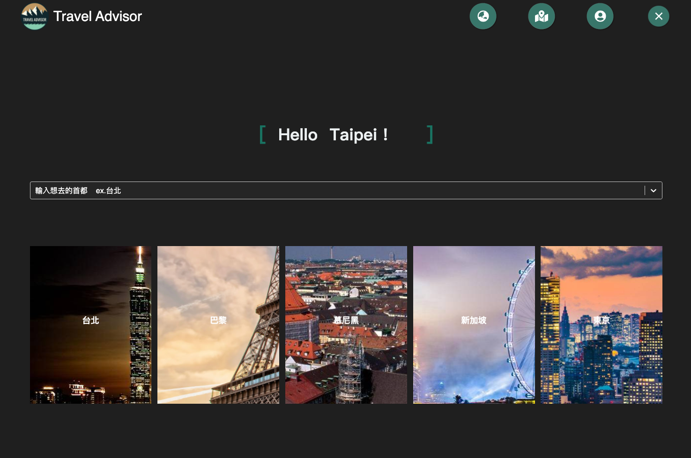
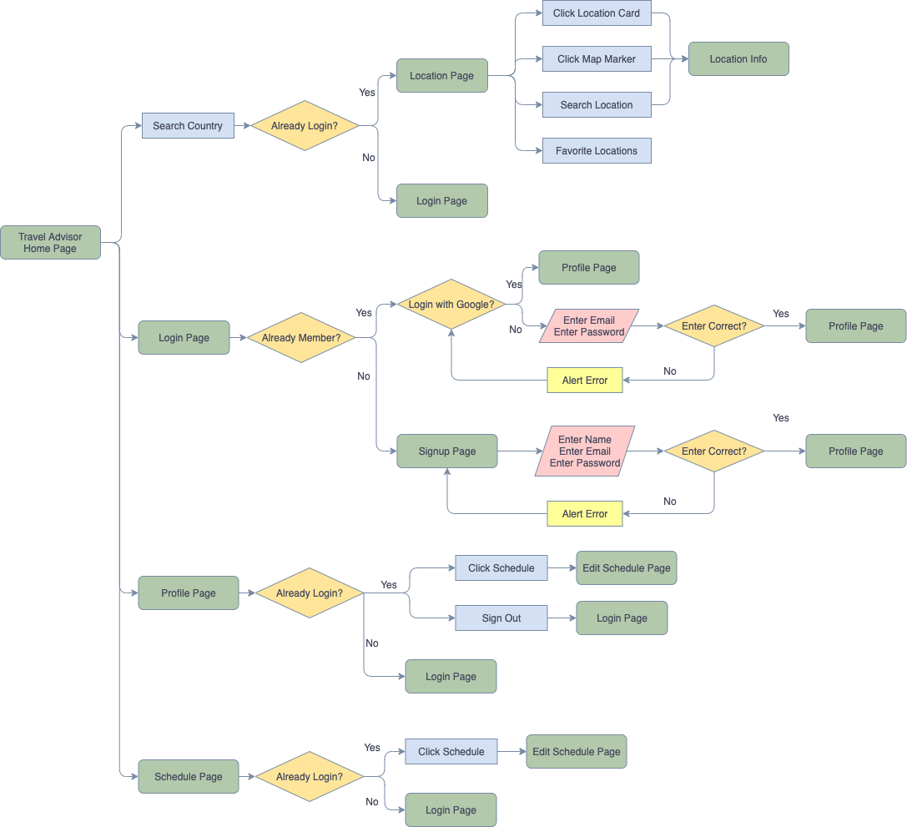
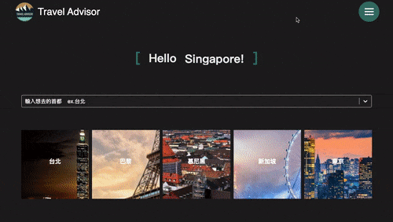
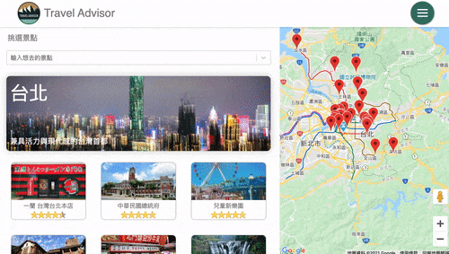
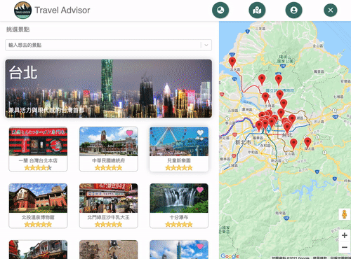
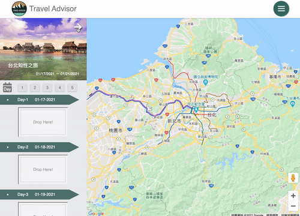

# TravelAdvisor

---

A website for tourist attractions introduction and itinerary planning.

## Demo

Link: https://tripadvisor-abc.web.app/  
User: test@gmail.com  
Password: 123456

## Technology

<ul>
  <li>Fundamental
    <ul>
      <li>HTML</li>
      <li>SCSS</li>
      <li>JavaScript</li>
    </ul>
  </li>
  <li>Framework
    <ul>
      <li>React</li>
      <li>React Router</li>
    </ul>
  </li>
  <li>Layout
    <ul>
      <li>RWD</li>
      <li>Flex Layout</li>
    </ul>
  </li>
  <li>Firebase
    <ul>
      <li>Database</li>
      <li>Storage</li>
      <li>Hosting</li>
      <li>Authentication</li>
    </ul>
  </li>
  <li>Library
    <ul>
      <li>Google Maps SDK</li>
      <li>Google Directions SDK</li>
    </ul>
  </li>
  <li>Tools
    <ul>
      <li>ESLint</li>
      <li>Prettier</li>
    </ul>
  </li>
</ul>

## User Flow

 

## Website Demo

<h3>Search for attractions in the city you want to visit.</h3>

<h3>Collect your favorite locations.</h3>

<h3>Easily drag the location cards to arrange the itinerary!</h3>

 

## Plan for Next Version

<ul>
  <li>Allow users to add their own locations.</li>
  <li>Allow users to memo their travel experience.</li>
  <li>Let users share their travel schedules to others.</li>
</ul>

## Contact

Email: fiona20072007@gmail.com
